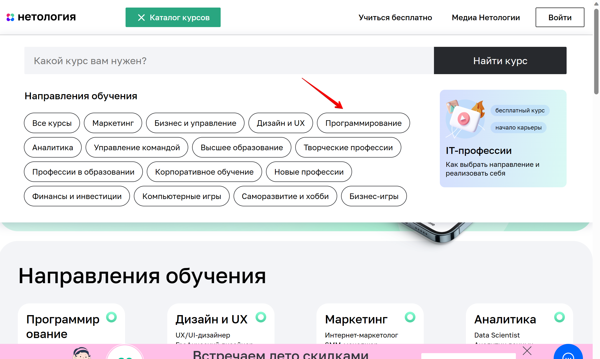
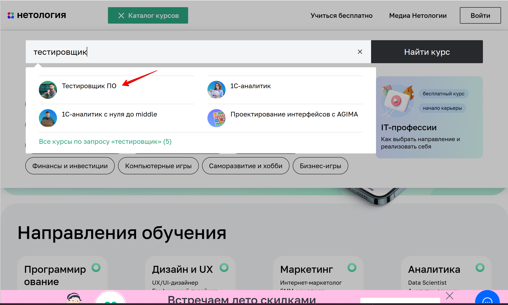
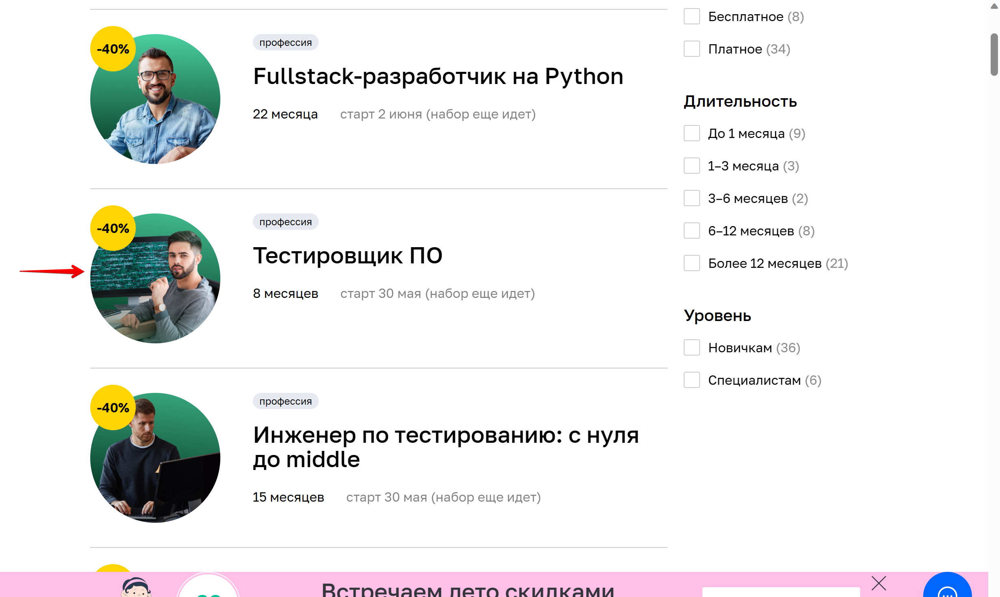
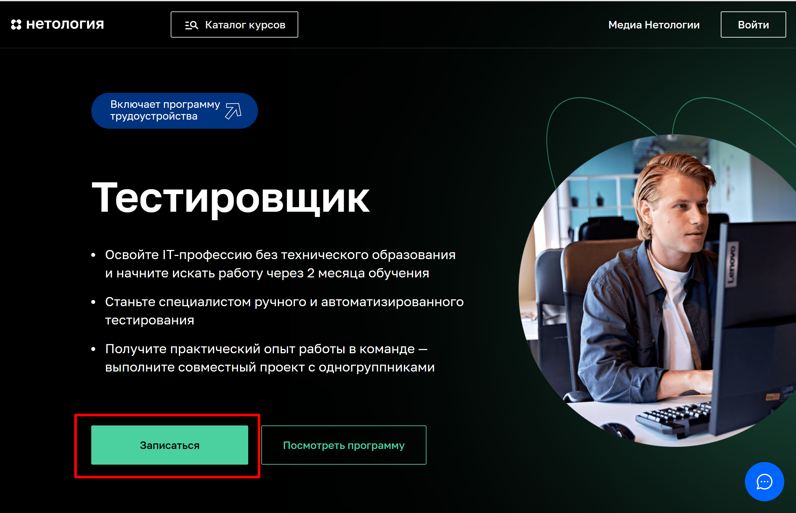
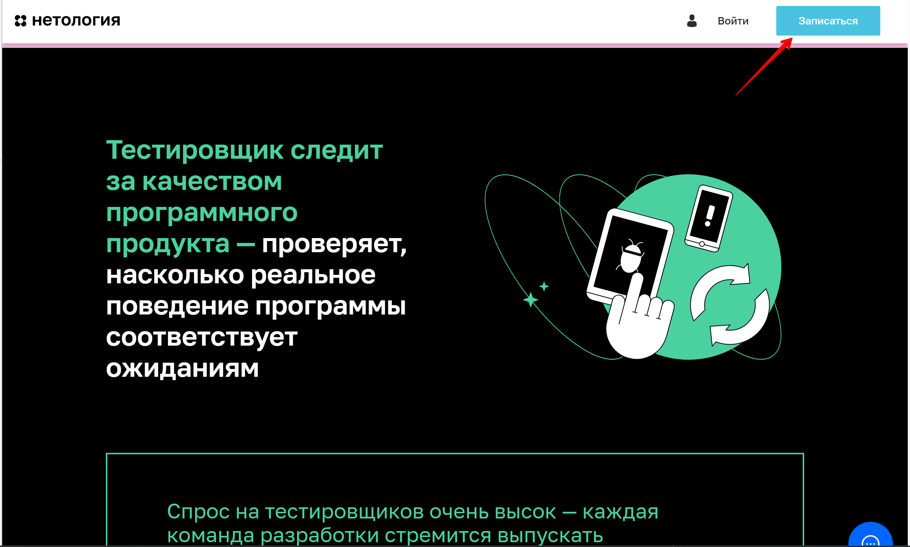

# План автоматизации тестирования возможности записи на обучение профессии "Тестировщик ПО"

### Уровни тестирования:
- Компонентное (модульное) тестирование - проверить функциональность и искать дефекты в частях анкеты для записи.
- Интеграционное тестирование - взаимодействие между компонентами системы.

### Виды тестирования:
- Дымовое тестирование - рассматривает как короткий цикл тестов, выполняемый для подтвержения того, что после сборки кода (нового или исправленного) устанавливаемое приложение стартует и выполняет основные функции.
- Функциональное тестирование - расматривает заранее указанное поведение и основывается на анализе спецификаций функциональности компонента или системы в целом.

## Перечень автоматизируемых сценариев:

### Сценарии перехода с главной страницы сайта (https://netology.ru) на страницу профессии «Тестировщик ПО»:

#### Предусловие выполнения сценария:
Ввод адреса страницы  (https://netology.ru) в адресную строку браузера; Переход по ссылке на сайта Нетологии

**Сценарий №1:**
1. нажать кнопку "Каталог курсов";
2. нажать в появившемся всплывающем окне "Программирование" (рис. 1);

Рисунок 1

3. прокрутить страницу до программы "Тестировщик ПО";
4. кликнуть по карточке "Тестировщик ПО".

**Сценарий №2:**
1. нажать кнопку "Каталог курсов";
2. в поисковой строке ввести "тестировщик";
3. в появившемся всплывающем окне выбрать "Тестировщик ПО" (рис. 2).

Рисунок 2

**Сценарий №3:**
1. нажать кнопку "Каталог курсов";
2. в поисковой строке  набрать "тестировщик";
3. нажать кнопку "Найти курс";
4. прокрутить страницу до карточки "Тестировщик ПО";
5. кликнуть по карточке  "Тестировщик ПО" (рис. 3).

Рисунок 3

**Сценарий №4:**
1. прокрутить Главную страницу к разделу (заголовку) "Направления обучения";
2. выбрать карточку "Программирование";
3. прокрутить страницу, до  карточки "Тестировщик ПО";
4. кликнуть по карточке  "Тестировщик ПО" (см. рис.3).

**Сценарий №5:**
1. прокрутить Главную страницу к разделу (заголовку) "Направления обучения";
2. кликнуть по карточке "Программирование";
3. в поисковой строке ввести "тестировщик";
4. в появившемся всплывающем окне выбрать "Тестировщик ПО" (см. рис.3).

**Сценарий №6:**
1. прокрутить Главную страницу к разделу "Направления обучения";
2. выбрать карточку "Программирование";
3. в поисковой строке ввести "тестировщик";
4. нажать кнопку "Найти курс";
5. прокрутить страницу до карточки "Тестировщик ПО";
6. кликнуть по карточке  "Тестировщик ПО" (см. рис.3).

**Сценарий №7:**
1. прокрутить Главную страницу к разделу "Направления обучения";
2. нажать кнопку "Полный каталог";
3. прокрутить страницу, до карточки "Тестировщик ПО";
4. кликнуть по карточке "Тестировщик ПО" (см. рис.3).

**Сценарий №8:**
1. прокрутить Главную страницу к разделу "Направления обучения";
2. нажать кнопку "Полный каталог";
3. в поисковой строке ввести "тестировщик";
4. в появившемся всплывающем окне выбрать "Тестировщик ПО" (см. рис. 2).

**Сценарий №9:**
1. прокрутить Главную страницу к разделу "Направления обучения";
2. нажать кнопку "Полный каталог";
3. в поисковой строке ввести "тестировщик";
4. нажать кнопку "Найти курс";
5. прокрутить страницу до карточки "Тестировщик ПО";
6. кликнуть по карточке  "Тестировщик ПО" (см. рис. 3);

**Сценарий №10:**
1. прокрутить Главную страницу к разделу "Направления обучения";
2. нажать кнопку "Полный каталог";
3. нажать  карточку "Программирование" в появившемся всплывающем окне (см. рис. 1);
4. прокрутить страницу до карточки "Тестировщик ПО";
5. кликнуть по карточке "Тестировщик ПО" (см. рис. 3);

**Сценарий №11:**
1. прокрутить главную страницу до "подвала";
2. нажать ссылку "Каталог курсов";
3. прокрутить страницу до карточки "Тестировщик ПО";
4. кликнуть по карточке  "Тестировщик ПО" (см. рис. 3).

**Сценарий №12:**
1. прокрутить главную страницу до "подвала";
2. нажать ссылку "Каталог курсов";
3. в поисковой строке ввести "тестировщик";
4. появившемся всплывающем окне выбрать "Тестировщик ПО" (см. рис. 2).

**Сценарий №13:**
1. прокрутить главную страницу до "подвала";
2. нажать ссылку "Программирование";
3. прокрутить страницу до карточки "Тестировщик ПО";
4. кликнуть по карточке  "Тестировщик ПО" (см. рис. 3).

**Сценарий №13:**
1. прокрутить главную страницу до "подвала";
2. нажать ссылку "Программирование";
3. в поисковой строке ввести "тестировщик";
4. в появившемся всплывающем окне выбрать "Тестировщик ПО" (см. рис. 2).

#### Общий итог всех сценариев: открылась страница курса "Тестировщик".

### Сценарии перехода на странице курса "Тестировщик ПО" к форме регистрации на курс:

#### Предусловие выполнения сценария:
открыта страница курса "Тестировщик ПО"

**Сценарий №1:**
- нажать кнопку "Записаться".
- 
  Рисунок 4

**Сценарий №2:**
- прокрутить страницу с курсом "Тестировщик ПО" вниз
- в появившемся pop- up нажать кнопку "Записаться".
  
  Рисунок 5

##### Общий итог всех сценариев №1 и №2: прокрутка страницы к форме записи на курс.

**Сценарий №3:**
- прокрутить страницу вниз до формы "Запишитесь на курс".

### Сценарии заполнения и отправки формы регистрации на курс:

#### Заполнение анкеты неавторизованным пользователем:

##### Сценарий HappyPath:
1. заполнить поле "Имя" буквами из кириллицы или латиницы
   не менее двух букв;
2. заполнить поле "Номер телефона" так же, как и по шаблону:
    - одиннадцать цифр;
    - форма ввода: +7 (999) 999-99-99);
    - разрешено от девяти до четырнадцати цифр;
3. заполнить поле "Электронная почта" корректным e-mail:
    - не должен содержать русских букв;
    - знак «собака» (@);
    - точку (.)
    - верное наименование почтового домена (mail.ru, yandex.ru, gmail.com и так далее)
4. кликнуть по кнопке "Записаться" - произойдет переход к экранной форме записи.
##### Ожидаемый результат: выскакивает сообщение об успешной записи

##### Сценарий UnHappyPath:
**Сценарий №1:**
1. заполнить поле "Имя" одной буквой;
2. заполнить поле "Номер телефона" валиднымизначением;
3. заполнить поле "Электронная почта" валидным значением;
4. кликнуть по кнопке "Записаться".
##### Ожидаемый результат: сообщение "Должно Должно быть не короче 2 символов".

**Сценарий №2:**
1. заполнить поле "Имя" цфрами;
2. заполнить поле "Номер телефона" валиднымизначением;
3. заполнить поле "Электронная почта" валидным значением;
4. кликнуть по кнопке "Записаться".
##### Ожидаемый результат: сообщение "Должно состоять из букв".

**Сценарий №3:**
1. заполнить поле "Имя" спецсимволами (например, $%*);
2. заполнить поле "Номер телефона" валидным значением;
3. заполнить поле "Электронная почта" валидным значением;
4. кликнуть по кнопке "Записаться".
##### Ожидаемый результат: сообщение "Должно состоять из букв".

**Сценарий №4:**
1. заполнить поле "Имя" валидным значением;
2. заполнить поле "Номер телефонане" по шаблону буквами";
3. заполнить поле "Электронная почта" валидным значением;
4. кликнуть по кнопке "Записаться".
##### Ожидаемый результат: сообщение "Номер в формате +9 (999) 999-99-99".

*Сценарий №4:**
1. заполнить поле "Имя" валидным значением;
2. заполнить поле "Номер телефонане" числами, количество которых менее 9ьше минимума по ТЗ;
3. заполнить поле "Электронная почта" валидным значением;
4. кликнуть по кнопке "Записаться".
##### Ожидаемый результат: сообщение "Номер в формате +9 (999) 999-99-99".

**Сценарий №5:**
1. заполнить поле "Имя" валидным значением;
2. заполнить поле "Номер телефонане" числами, количество которых привышает максимум по ТЗ;
3. заполнить поле "Электронная почта" валидным значением;
4. кликнуть по кнопке "Записаться".
##### Ожидаемый результат:  сообщением"Номер в формате +9 (999) 999-99-99".

**Сценарий №6:**
1. заполнить поле "Имя" валидным значением;
2. заполнить поле "Номер телефона" валидным значением;
3. заполнить поле "Электронная почта" русскими буквами;
   без знака «собака» (@)
   без точки (.)
4. кликнуть по кнопке "Записаться".
##### Ожидаемый результат: сообщение "Неверный email".

**Сценарий №7:**
1. заполнить поле "Имя" валидным значением;
2. заполнить поле "Номер телефона" валидным значением;
3. заполнить поле "Электронная почта" без знака «собака» (@);
   без точки (.)
4. кликнуть по кнопке "Записаться".
##### Ожидаемый результат: сообщение "Неверный email".

**Сценарий №8:**
1. заполнить поле "Имя" валидным значением;
2. заполнить поле "Номер телефона" валидным значением;
3. заполнить поле "Электронная почта" без точки (.);
4. кликнуть по кнопке "Записаться".
##### Ожидаемый результат: сообщение "Неверный email".
#### Общий ожидаемый результат для сценариев UnHappyPath: запись на курс не происходит.

##### Сценарий EmptyPath:

**Сценарий №1:**
1. не заполнять поле "Имя"
2. заполнить поле "Номер телефона" валидным значением;
3. заполнить поле "Электронная почта" валидным значением;
4. кликнуть по кнопке "Записаться".
##### Ожидаемый результат: сообщение "Обязательное поле".

**Сценарий №2:**
1. заполнить поле "Имя" валидным значением;
2. Не заполнять поле Номер телефона валидным значением;
3. заполнить поле "Электронная почта" валидным значением;
4. кликнуть по кнопке "Записаться"
##### Ожидаемый результат: сообщение "Обязательное поле".

**Сценарий №3:**
1. заполнить поле "Имя" валидным значением;
2. заполнить поле "Номер телефона" валидным значением;
3. не заполнять поле "Электронная почта";
##### Ожидаемый результат: сообщение "Обязательное поле".
#### Общий ожидаемый результат для сценариев emptyPath: запись на курс не происходит.

#### Заполнение анкеты авторизованным пользователем

##### Сценарий AuthorizedUser:
1. в форме авторизации нажать кнопку "Войти";
2. авторизоваться с данными зарегестрированного пользователя;
3. поле "Имя" и "Номер телефона" заполнены теми данными, которые указывались при регистрации
4. поле "Электронная почта" отсутствует;
5. кликнуть по кнопке "Записаться".
#### Общий ожидаемый результат для сценариев AuthorizedUser: успешная запись на курс.

## Перечень используемых инструментов с обоснованием выбора:
- _IntelliJ IDEA 2022.3.1 (Community Edition)_ - среда разработки, мощная и удобная, поддержка многих языков программирования, в частности Java, JavaScript, Python,с поддержкой всех последних технологий и фреймворков. Версия Community Edition бесплатная.
- _Java 11_ язык для написания автотестов, имеет набор готового ПО для разработки и запуска приложений.
- _Gradle_ понадобится для сборки проекта, для управления подключенными зависимостями, а так же для генерации отчётов о тестировании. Он прост в использовании благодаря тому, что билд скрипты короче и чище чем у Ant и Maven.
- _JUnit 5_ необходим для написания и запуска тестов. Не требует контроля пользователя во время исполнения тестов, может запускать одновременно нектолько тестов, сообщает обо всех ошибках в ходе тестиования, предоставляет готовый набор методов для сравнения ожидаемого и фактического результатов.
- _Docker_ — это программное обеспечение, которое дает возможность на определенном участке памяти изолированно установить необходимую ОС (операционную систему), версию Java, настроить переменные окружения, установить различные зависимости и дать доступ только при определенных условиях.
- _Selenide_ фреймвор,необходимый, для тестирования GUI. Помогает делать стабильные тесты, решая почти все проблемы с таймаутами, автоматически управляет браузером и делает скриншоты если тест упал.
- _Lombok_ - основанная на аннотациях библиотека Java, позволяющая сократить шаблонный код, уменьшает трудозатраты и время на разработку и обеспечивает некоторую дополнительную функциональность.
- _Faker_- библеотека, необходимая для генерации тестовых данных.
- _Rest Assured_ - java-библиотека для тестирования REST API, позволяет автоматизировать тестирование get и post запросов.
- _Allure_ - фреймворк для создания отчетов о тестировании,  наглядного отоображения прохождения тестов и ошибок. Обдадает более широким представление отчетов об проводимых тестах, чем Gradle.
- _Git и GitHub_ для ведения репозитория по проектам. Git достаточно прост и удобен для управления исходным кодом, очень распространенная система контроля версий, поэтому достаточно хорошо взаимодействует с различными ОС. GitHub специализированный веб-сервис с удобным интерфейсои, интегрирован с Git.
- _AppVeyor_ - распределённый веб-сервис непрерывной интеграции, предназначенный для сборки и тестирования программного обеспечения расположенного на GitHub и других сервисах хранения исходного кода (включая GitLab и Bitbucket), использующий виртуальные машины Microsoft Windows и Ubuntu. Этот сервис удобен тем что он имеет бесплатный базовый тариф, может осуществлять сборку как под управлением Linux, так и под Windows, а если необходимо то под несколькими сразу.

## Перечень необходимых разрешений/данных/доступов:
- если проект реализует не сама Нетология, то необходимо письменное разрешение на проведение тестирования от владельца веб-сайта Нетологии.;
- нужен доступ к API и БД (доступ к действующей базе данных несет определенные риски) для проверки результатов выполнения тестов;
- техническая документация, для понимания валидных и невалидных данных и др. требований.
- API для отправки GET и POST запросов на сервер.

## Перечень и описание возможных рисков при автоматизации:
- отсутствие технической документации.
- не значительное изменение реализации веб-элементов на странице, могут привести к падению ранее написаных авто-тестов.
- авто-тесты не проверяют графический интерфейс (GUI) сайта;
- возможно "Замусовариние" бызы данных;
- ложные срабытывания по отправке форм, что в свою очередь может увеличить нагрузку по обработке данных.

## Перечень необходимых специалистов для автоматизации
инженер по автоматизации

## Интервальная оценка с учётом рисков в часах
Ориентировочное время реализации: 30 человекочасов. Возможно распараллеливание проекта, так как сценарии перехода на страницу не зависят от сценариев заполнения и отправки формы.